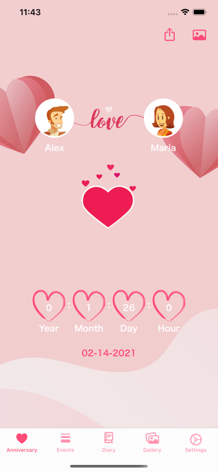

# Love Diary
[Sweet Memory app] "Love Memory" is a beautiful and easy-to-use diary app. So please download and try the best diary app for lovers!

## Screenshots

 

 
## Functions

- Count the number of days of love
- Set cover image
- Secure with passcode lock
- Change theme color
- Tag search
- Event and Reminder
- Advertisement banner
- Icloud backup

"Love Memory" is the best and sweet diary app for lovers. Please try this app!

## The application use MVVM

- Testable
- UI-independent (the UI can easily be changed without changing the system)
- Independent of databases, frameworks, external agencies, and libraries

## The software architecture scheme

- The UI can only communicate with the ViewModel
- The ViewModel can only communicate with the Repository
 
